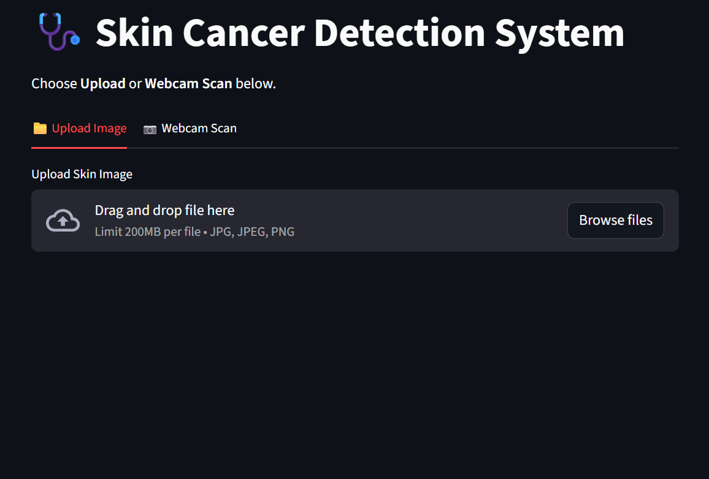
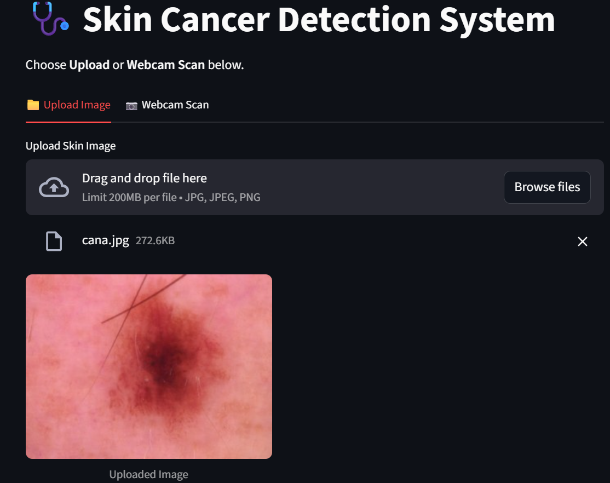
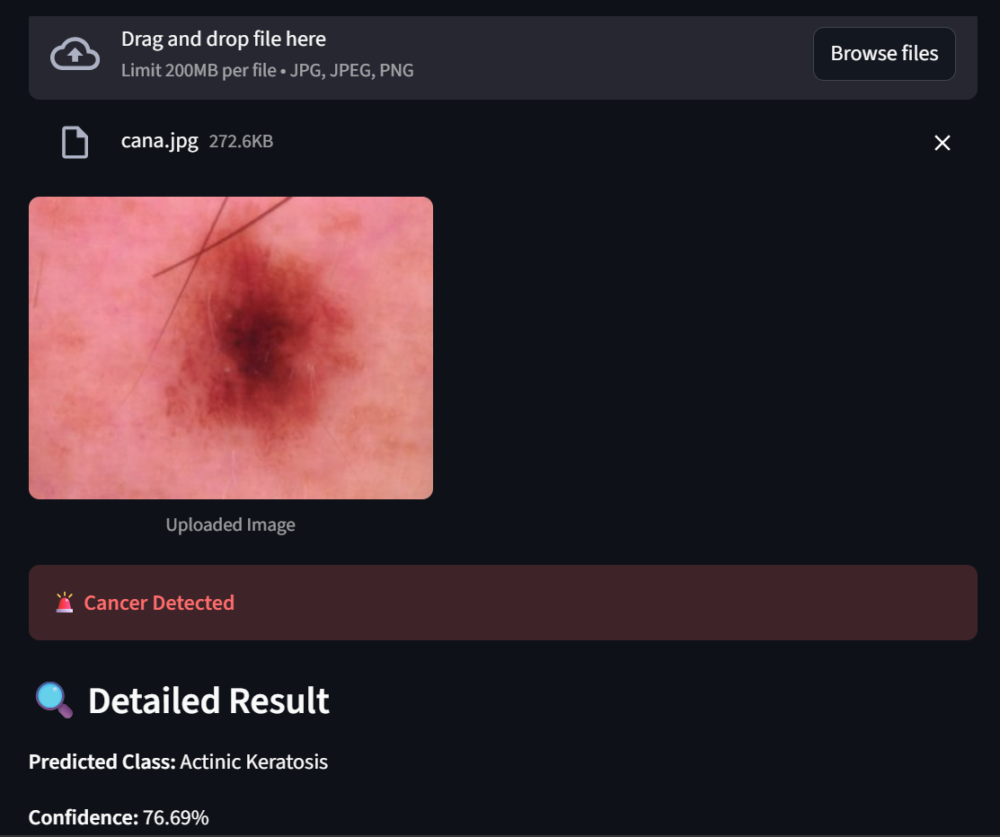
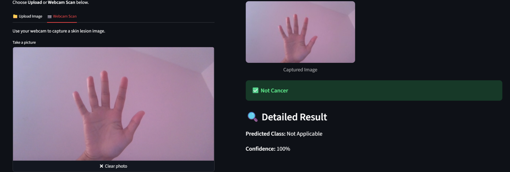

# Skin-Cancer-Detection-CNN-YOLOv8
Real-time skin cancer detection using CNN and YOLOv8 for early diagnosis with webcam feed.
# OVERVIEW
This project focuses on the detection of skin cancer using advanced deep learning techniques- Convolutional Neural Network(CNN) and YOLOv8 for real-time detection.
The system is designed to analyze the skin lesion images and identify the potential cancerous regions, helping in the early detection and improving the healthcare outcomes. This model observes skin surface layer-by-layer and identifies irregularity like moles, spots or any pigmented lesions. Overall, the model contributes toward improving diagnostic efficiency, minimizing human error, and supporting timely medical intervention, thereby playing a significant role in enhancing patient outcomes and advancing AI-driven healthcare solutions.

# PROBLEM STATEMENT
Skin cancer remains one of the most common and life-threatening malignancies worldwide, and its prognosis depends on early detection of malignant lesions. Despite the proven benefits of early screening, many people do not have timely access to dermatologists, dermatoscopes, or specialized imaging systems, particularly in rural or resource-limited settings. As a result, after significant enrollment, many cases are diagnosed for which treatment is complex, expensive, and less effective.

Advances in deep learning have made it possible to automatically analyze skin lesions with high accuracy in research settings, but these systems typically rely on dermatoscopic images taken under ideal conditions. However, real-world users rely on basic cameras such as laptop or mobile phone webcams, which often suffer from poor lighting, out-of-focus, broken focus, and changes in camera angle or distance. Models trained only on controlled databases often perform poorly in unconstrained environments, limiting their clinical value in the real world. 

# METHODOLOGY
# System Architecture
The skin cancer detection system developed in this project features a modular and scalable architecture, combining deep learning–based image analysis with a user-friendly web interface. Each of these four major components constitutes the system: a frontend web application for image acquisition, a backend deep learning inference engine, an image preprocessing module, and a prediction visualization unit. The modular architecture ensures each module communicates smoothly and easily extends the system for more future enhancements, such as generating medical reports or integrating with a clinical database.

# Dataset And Preprocessing
The dataset utilized in this system is obtained from the ISIC dataset that comprises dermoscopic images of different skin lesion categories. There are nine different classes involved in the dataset : Actinic Keratosis, Basal Cell Carcinoma, Dermatofibroma, Melanoma , Nevus, Pigmented Benign Keratosis, Seborrheic Keratosis, Squamous Cell Carcinoma, and Vascular Lesions.

# AI Model Training And Testing
To classify skin lesions more accurately, the employment of a Convolutional Neural Network is carried out because of its great efficiency in extracting features (both spatial and texture-based) from medical images. The architecture of the CNN model entails various convolutional layers followed by max-pooling layers for capturing hierarchical features, a flattening layer, and finally fully connected dense layers for the classification purpose.The categorical cross-entropy loss and Adam optimizer are used to train the model. During training, performance metrics such as accuracy and loss are monitored continuously in both training and validation datasets. The generalization capability of the trained model is evaluated on unseen test images. After training, the final model is saved in .h5 format and further integrated into the web application for real-time inference. Cancerous classes are grouped to provide the final decision as either “Cancer Detected” or “Not Cancer”.

# Web-based Image Input and Prediction
Further, a web-based interface is developed that allows the user to interact easily with the system. For this interface, there are two options for input: image upload from local storage and real-time image capture using a webcam. After image submission, the backend CNN model processes the submitted image and instantly shows the prediction result. The output will provide the lesion class, confidence score, and clearly indicate whether the lesion is either cancerous or non-cancerous. This approach, being web based, facilitates remote screening and preliminary assessment without the need for specialized dermatological equipment.

# Image Processing and Feature Extraction
Preprocessing of images plays an important role in increasing the accuracy of prediction. After acquisition, the input image is converted into RGB format and then resized according to the model's input shape. The CNN extracts automatically low-level features at early layers, which include edges, color variations, and texture patterns, while deeper layers learn high-level semantic features that are malignant and benign lesion-specific.This automated feature extraction removes the burden of manual feature engineering and enhances the ability of the system to identify subtle visual differences between cancerous and non-cancerous skin lesions.

# TECHNOLOGIES USED
 1.Python  
 2.Keras  
 3.OpenCV  
 4.YOLOv8  
 5.CNN models  
 6.Webcam integration  
 7.ISIC dataset  

 # RESULTS

# CONCLUSION
The proposed skin cancer detection system provides an efficient method for identifying abnormal skin lesions using image-based analysis. Supporting both image upload and real-time webcam scanning, the system allows for early observation of suspicious skin conditions, which is critical for timely medical intervention. The web interface is designed to be user-friendly, providing ease of access and practical use for preliminary screening.

This will help reduce the effort put into manual examination and improve the results of early diagnosis. With further verification and testing on larger clinical data, the model can be developed further to become a trustworthy supportive tool in dermatological assessment and remote health screening.

# FUTURE ENHANCEMENTS
Even though advancements are constantly being made, some paths seem to hold great promise for improving the skin cancer detection system's capabilities. Future developments can improve accuracy, usability, and clinical relevance for the benefit of patients and medical professionals, even though the current model can successfully classify skin lesions and support real-time image analysis.
# Dermatology and Medical Record Systems Integration
By integrating it with hospital databases and electronic medical record systems, the system can be further enhanced by giving dermatologists access to patient lesion histories, historical predictions, and information about lesion developments all in one location.
# Advanced Lesion Analysis and Risk Assessment
In order to evaluate lesion evolution over time, future iterations of the system may incorporate sophisticated image analytical techniques. It may outline differences in a lesion's size, color, or shape and estimate the risk level of a lesion by comparing images from the past and present. These improvements would undoubtedly aid in early detection and prioritize high-risk cases for prompt medical attention.
# Automated Clinical Referral and Alert Mechanism
In the event of a high-risk detection, this system can be further expanded to automatically suggest dermatological consultation. It might be integrated with telemedicine platforms, allowing for secure lesion image sharing with specialists or instant appointment scheduling. Particularly for patients who reside in remote or underserved areas, this feature will ensure prompt medical interventions and decrease diagnostic delays.
